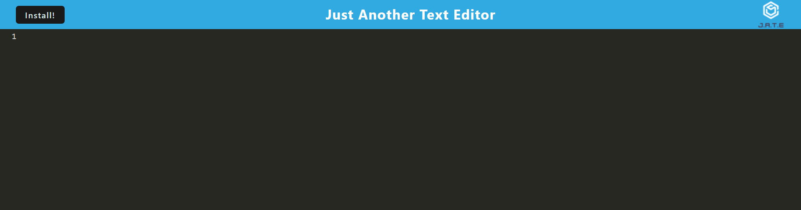

# Text Editor

## Introduction

A basic text editor run with Progressive Web App.

## Table of Contents 
1. [Installation](#installation)
2. [Usage](#usage)
3. [Test](#test)
4. [Images](#images)
5. [Credits](#credits)
6. [Licenses](#licenses)

## Installation 

Clone the repository found at https://github.com/EllisJLC/Text_Editor. Navigate to the directory through the command `cd text_editor`. Run the command `npm install` to install the necessary node packages.

## Usage

As a text editor in the browser.

## Test

Run the program or open the live link at https://texteditor14152.herokuapp.com/. Input text. Select the "Install!" button to save code.

## Images

### Site Preview

## Credits

Starter code was created by Xandromus - https://github.com/Xandromus. PWA configuration by Jia Liang (Ellison) Chen - https://github.com/EllisJLC

## Licenses 

The MIT License: https://opensource.org/licenses/MIT